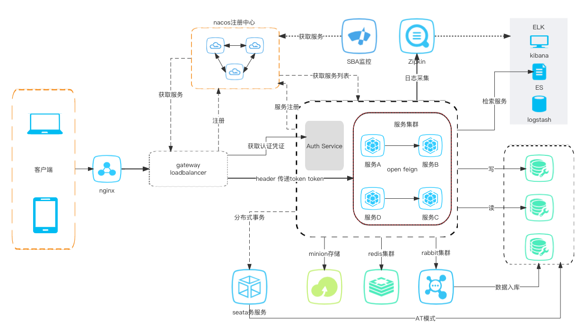

开源微服务框架项目技术文档，使用SpringBoot2.x和SpringCloud框架，并采用前后端分离的架构。 
前端使用vite+vue3+element ui开发。 
实现了基于security+jwt的RBAC权限认证方案。
SBA服务监控。 
stream消息组件。
zipkin链路追踪。
seata分布式事务AT实现。
minio文件存储服务。 
redis缓存。 
swagger文档服务。
#### 技术交流群：713347148
*****
#### 本项目的所有代码都是免费开源的，业余时间维护。
项目地址：https://github.com/haojias/sc-dev-1
*****
#### 项目简介
1. 前后端分离的微服务架构
2. 后端基于Spring boot2.4.2、Spring cloud 2020.0.1、Spring cloud alibaba 2021.1
3. 基于Spring security + jwt 实现无状态的登录认证方案
4. 支持docker
5. 组件化，支持根据需求引入相关组件配置
6. 非常适合小团队使用和个人学习
#### 功能架构图
#### 
